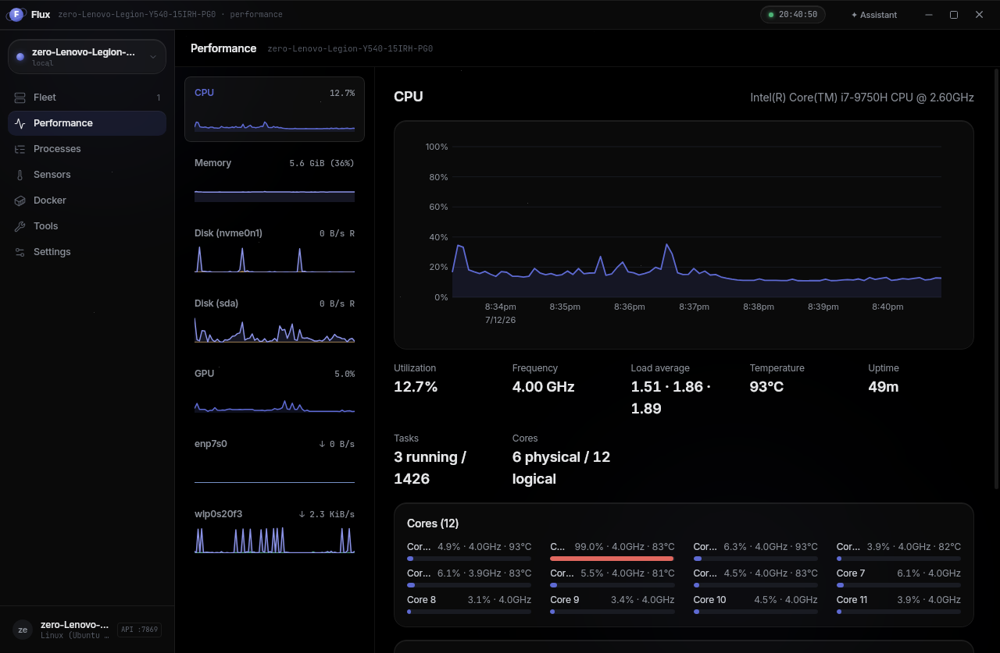
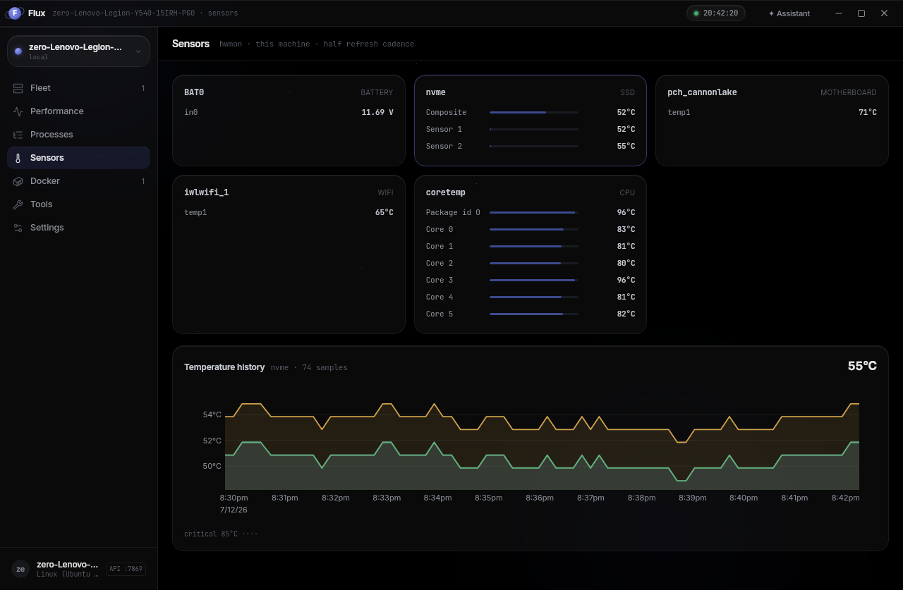

# Flux

A fast Linux system monitor and fleet dashboard. One app to watch this
machine and every other box you can SSH into — no server, no agents to
babysit, no cloud.

Built with Tauri v2 (Rust) + React, so it idles light and draws charts at
native speed. Glass-dark UI: pure-black canvas, ambient glows, translucent
panels, Inter + JetBrains Mono.



| | |
|---|---|
|  |  |
|  |  |

## What it does

- **Performance** — live CPU (per-core), memory, per-disk I/O, per-interface
  network, and NVIDIA GPU charts with 90-sample history.
- **Processes** — Task-Manager-style table: grouped by app, heat-shaded
  CPU/memory/disk columns, search, kill/renice.
- **Fleet** — monitor any Linux machine over SSH:
  - *Agentless*: one batched `/proc` read per tick over the SSH channel.
    Works on anything with `sh` — nothing installed on the target.
  - *Agent mode*: one click uploads a small static binary
    (`flux-agent`) for full process detail; auto-falls back to agentless
    if it dies.
  - Trust-on-first-use host keys, own ed25519 identity — your `~/.ssh`
    is never touched. Passwords are used once to install the key, never
    stored.
- **Docker** — containers (live CPU/mem sparklines, logs, inspect, real
  `docker exec` shell via xterm.js), images, volumes, networks, compose
  projects (up/down/build/logs), disk usage + prune.
- **Sensors** — hwmon temperatures, fans and voltages with history chart.
- **Tools** — systemd services, startup apps, system cleaner, package
  uninstaller, hardware info.
- **HTTP API** — register hosts from scripts/CI: see [docs/API.md](docs/API.md).
- **Usage logging** — record samples to CSV for later analysis.
- **Privacy lock** — Fleet, the Assistant and the machine picker hide behind
  a password. Fresh installs ship locked; the factory password is
  `Admin@123#` — unlock in Settings → Privacy lock and set your own.
  It's a screen-privacy gate, not a security boundary.

## Install (Ubuntu)

Supported: 22.04 (jammy), 24.04 (noble), 26.04 (resolute).

```bash
curl -fsSL https://srr-alt.github.io/flux-apt/setup.sh | sudo bash
```

That registers the signed apt repo and installs Flux; updates then arrive
via normal `apt upgrade`.

<details>
<summary>Manual setup (no curl-pipe)</summary>

```bash
sudo install -d -m 0755 /etc/apt/keyrings
curl -fsSL https://srr-alt.github.io/flux-apt/pubkey.gpg | sudo gpg --dearmor --yes -o /etc/apt/keyrings/flux.gpg
echo "deb [signed-by=/etc/apt/keyrings/flux.gpg] https://srr-alt.github.io/flux-apt $(lsb_release -cs) main" | sudo tee /etc/apt/sources.list.d/flux.list
sudo apt update && sudo apt install flux
```

</details>

Standalone `.deb`s and the static `flux-agent-linux-amd64` binary are on the
[releases page](https://github.com/srr-alt/flux/releases).

Ubuntu 20.04 is not supported (Tauri v2 needs webkit2gtk-4.1).

## Build from source

Prereqs: Rust stable, Node 20+, and the
[Tauri v2 Linux deps](https://v2.tauri.app/start/prerequisites/) (webkit2gtk-4.1,
gtk3, libayatana-appindicator, librsvg).

```bash
npm install
npm run tauri dev      # run with hot reload
npm run tauri build    # produce a .deb/binary for your distro
```

Release packaging for all supported distros runs in Docker:
`packaging/release.sh <version>` (see [GITHUB.md](GITHUB.md) for the full
release/apt pipeline).

## Repository layout

| Path | What |
|------|------|
| `src/` | React frontend (Tailwind v4, uPlot, Zustand) |
| `src-tauri/` | Desktop app: local collectors, SSH remote monitoring, HTTP API |
| `crates/flux-core` | Shared collectors + agent protocol (used by app and agent) |
| `crates/flux-agent` | Headless JSON-lines agent binary deployed to remote hosts |
| `packaging/` | Multi-distro Docker builds, apt repo (reprepro), release script |
| `docs/API.md` | Local HTTP API reference |

> Note: the repo is still named `vantage` (the app's old name); the app,
> packages, and binaries are all `flux`.
